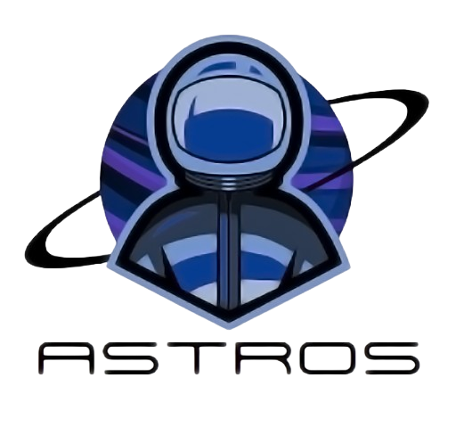

<h1 align="center">Astros</h1>

<p align = "center">
  
</p>

<br>

<p align = "center">
    
    
    
    
    
</p>

## 📋 Description
  Offering a variety of mini-games and interactive planetary lore, take this new command blocking system developed by highly skilled engineers on a whirlwind adventure through the universe in. 
  The program offers replayability and fun learning experiences for all ages.


## 🚀 Languages 
  <p align="left"> 
  <a href="https://www.cplusplus.com/"></a>
 
  </p>

## 🔧 Tools 
  <p align="left"> 
  <a href="https://visualstudio.microsoft.com/"></a>
    <a href="https://www.microsoft.com/en-ww/microsoft-365/word"></a>
    <a href="https://www.microsoft.com/en-us/microsoft-365/powerpoint">
    <a href="https://git-scm.com/"></a>
    <a href="https://www.adobe.com/bg/">
    <a href="https://www.adobe.com/bg/">
      <a href="https://git-scm.com/"></a>
  </p> 
  
## 💼 Documents
  <ul>
    <li><a href="documentation/ASTROS-documentation.docx">Documentation</a></li>
    <li><a href="documentation/ASTROS-presentation.pptx">Presentation</a></li>
   </ul>


## 🔧 Installation

```
You can download our project by using the green "Code" button.

Or by pasting the following code in your CMD:
git clone https://github.com/codingburgas/2324-space-sprint-project-astros.git
```

## ⚙ Website Access

*You can access our website by pasting this link into your browser.*
```
  https://github.com/codingburgas/2324-space-sprint-project-astros.git
```

## 🖥 Team Members
* **Hristo Rusev** - *Scrum trainer* 
* **Ivan-Mihail Ivanov** - *Back-end developer* 
* **Teodora Skulieva** - *Back-end developer* 
* **Zlatin Lazarov** - *Back-end developer*


 