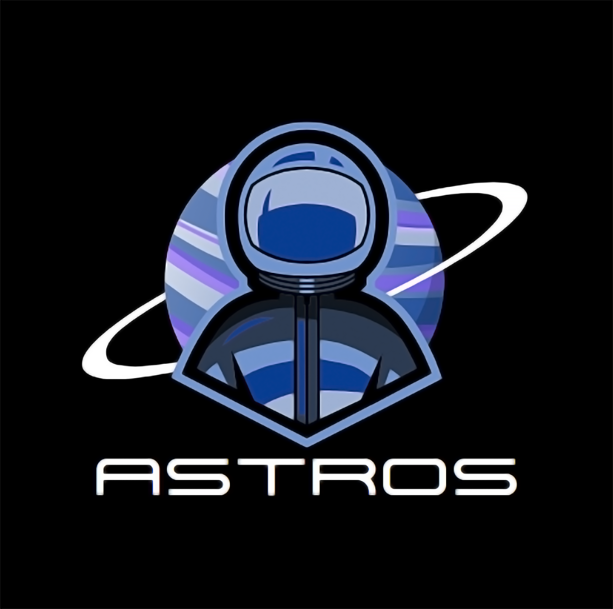

<h1 align="center">Team ASTROS</h1>

 

 

 

## 💻 About

 

This repository contains our submission for the second 2023/2024 project - "Code Sprint - Space Expedition"!

 

## 🗂️ Used Technologies

 

### Used code editor & collaborative service:

 

 

### Used tools for our visual elements:

 

 

### Used tools for our site development:

 

 

### Used tools for our documentation, presentation & communication:

 

 

 

## 📄 Documents

### Presenting and Team Documentation

- [Astros Documentation](documentation/ASTROS-documentation.docx)
- [Astros Presentation](documentation/ASTROS-presentation.pptx)
 

 

## 🧒 Our Team

 

- <a href = "https://github.com/HPRusev22">Hristo Rusev</a> (SCRUM Trainer) 
- <a href = "https://github.com/ZRLazarov22">Zlatin Lazarov</a> (Back-end Developer)
- <a href = "https://github.com/TDSkulieva22">Teodora Skulieva</a> (Back-end Developer)
- <a href = "https://github.com/IIIvanov22">Ivan-Mihail Ivanov</a> (Back-end Developer)

 